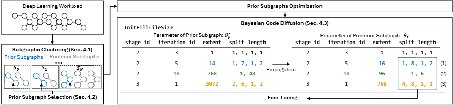

# Bayesian Code Diffusion Artifacts [OSDI 2025]


- This repository contains an implementation of Bayesian Code Diffusion.
- It is also based on Apache TVM v0.15.0 ([GitHub link](https://github.com/apache/tvm)).

## Introduction



Bayesian Code Diffusion optimize deep learning programs with reduced compilation time by clustering subgraphs and diffusing reusable optimization parameters.


## Installation

This code has been tested with the Docker image `nvidia/cuda:11.3.1-devel-ubuntu20.04`.

### Prerequisites

Execute the following commands to install the required packages. CMake version 3.18 or higher is required.

```bash
apt-get update
apt-get install -y python3 python3-dev python3-setuptools gcc libtinfo-dev zlib1g-dev build-essential libedit-dev libxml2-dev cmake ninja-build
```

Additionally, install LLVM:
```bash
apt-get install llvm
```

### Setting CUDA Environment Variables

Edit your `.bashrc` file to include the CUDA paths:
```bash
vi ~/.bashrc

# Add the following lines:
export PATH="/usr/local/cuda-11/bin:$PATH"
export LD_LIBRARY_PATH="/usr/local/cuda-11/lib64:$LD_LIBRARY_PATH"
```

After modifying `.bashrc`, reload your environment variables by running:
```bash
source ~/.bashrc
```

Verify the CUDA installation by running `nvcc -V`. You should see an output similar to:

```bash
nvcc -V

# nvcc: NVIDIA (R) Cuda compiler driver
# Copyright (c) 2005-2021 NVIDIA Corporation
# Built on Mon_May__3_19:15:13_PDT_2021
# Cuda compilation tools, release 11.3, V11.3.109
# Build cuda_11.3.r11.3/compiler.29920130_0
```

### Building Ansor and BayesianCodeDiffusion

Build Ansor by running the following commands:

```bash
mkdir -p tvm-ansor/build
cp config/config.cmake tvm-ansor/build/
cp config/compile.sh tvm-ansor/build/
cd tvm-ansor/build
bash compile.sh
cd -
```

Similarly, build BayesianCodeDiffusion by running:

```bash
mkdir -p tvm-bayesian_code_diffusion/build
cp config/config.cmake tvm-bayesian_code_diffusion/build/
cp config/compile.sh tvm-bayesian_code_diffusion/build/
cd tvm-bayesian_code_diffusion/build
bash compile.sh
cd -
```

### Setting up Python Virtual Environments

Create a Python virtual environment:

```bash
python3 -m venv venv
source venv/bin/activate
pip install -r ./config/requirements.txt
```

## Example

Execute the following commands from the `experiments` directory to run the provided example script:

```bash
cd experiments
bash script.sh
```

This script runs Ansor and BayesianCodeDiffusion for the `SqueezeNetV1.1` model on both CPU (llvm) and GPU (cuda). The target model can be specified using the `model` argument, and the target hardware can be selected using the `target` argument.

Performance results are saved in the subdirectories `log_ansor/squeezenet_v1.1` and `log_codediffusion*/squeezenet_v1.1`, where they can be compared. In these directories, the generated `*.tsv` files allow for direct comparison of `compilation time (ElapsedTime)` and `program latency (EstimatedLatency)`.

**Configurable Arguments**
- `model`: Specifies the deep learning model to be compiled.
- `target`: Specifies the target hardware for compilation (`llvm` for CPU, `cuda` for GPU).
- `group_type`: Specifies the clustering method used in BayesianCodeDiffusion.
    - `group_type=sketch`: Uses sketch-based clustering.
    - `group_type=operator`: Uses operator-based clustering.
- `num_measures_per_round`: Defines how many programs are executed during each round of hardware measurements.
- `num_trials`: Sets the total search time budget. The actual budget is calculated as `num_trials * num_subgraphs`, where `num_subgraphs` depends on the specific model.